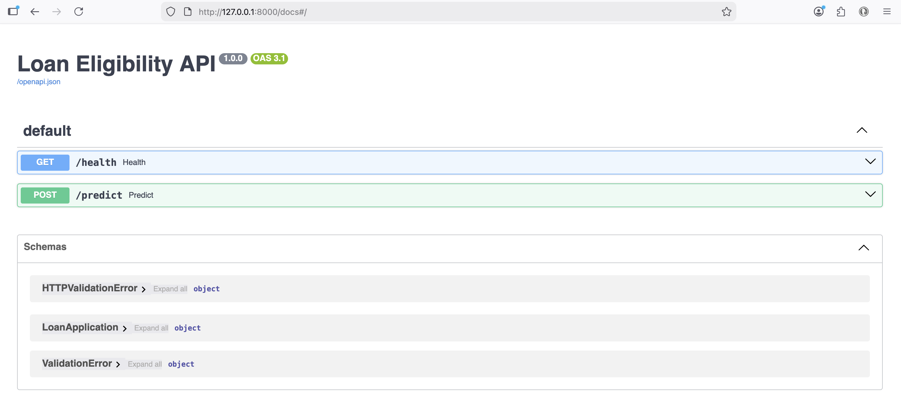
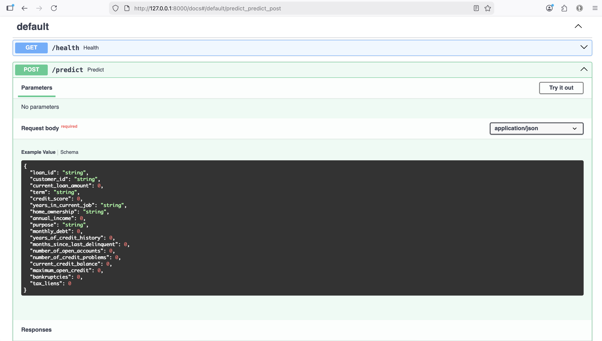
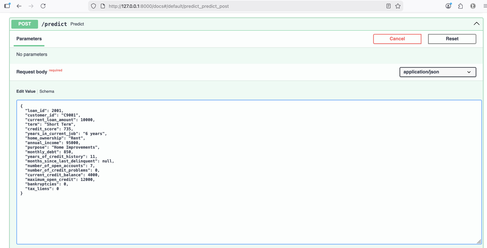
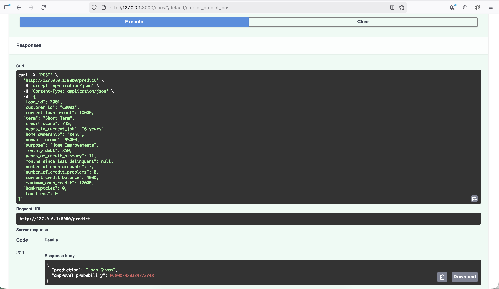
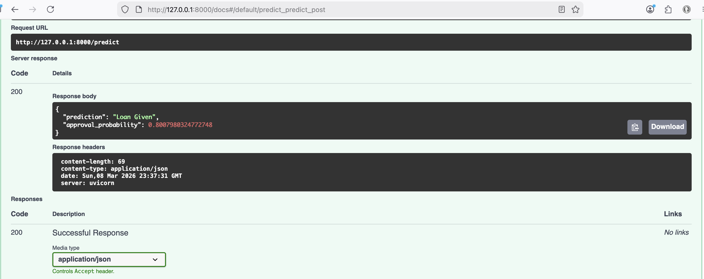

# Loan Eligibility Prediction – End-to-End ML Pipeline

This project implements an **end-to-end machine learning pipeline** for predicting loan eligibility using financial and credit history data.

The system includes **data preprocessing, feature engineering, model training, batch prediction, and a FastAPI deployment for real-time inference**.

The goal is to demonstrate how a machine learning model can move from **raw data to a production-ready API service**, following practical ML engineering and MLOps practices.

---

## Key Features

- Data cleaning and preprocessing pipeline
- Feature engineering for financial indicators
- Multiple model training and evaluation
  - Logistic Regression
  - Random Forest
  - Gradient Boosting
- Model selection based on ROC-AUC
- Batch prediction on new loan applications
- REST API for real-time predictions using FastAPI
- JSON input format for prediction requests
- Structured ML project layout for production readiness

---

## Model Performance

Best model: **Gradient Boosting**

| Model | Accuracy | ROC-AUC |
|------|------|------|
| Logistic Regression | ~0.65 | ~0.67 |
| Random Forest | ~0.73 | ~0.74 |
| Gradient Boosting | **~0.74** | **~0.75** |

---

## API Example

### Request

```json
{
  "loan_id": 2001,
  "customer_id": "C9001",
  "current_loan_amount": 10000,
  "term": "Short Term",
  "credit_score": 735,
  "annual_income": 95000
}
```
### Response

```json
{
  "prediction": "Loan Given",
  "approval_probability": 0.89
}
```

## Project layout

```text
loan_eligibility_mlops/
├── app/
│   └── main.py
├── data/
│   ├── predictions/
│   └── raw/
├── models/
├── src/
│   ├── config.py
│   ├── predict.py
│   ├── preprocessing.py
│   └── train.py
├── tests/
│   └── test_preprocessing.py
├── Dockerfile
├── README.md
└── requirements.txt
```

## What changed from the notebook version

- moved logic out of notebooks into reusable Python modules
- replaced fragile `factorize()` encoding with `OneHotEncoder(handle_unknown="ignore")`
- packaged preprocessing and model together in a single sklearn `Pipeline`
- added engineered features such as debt-to-income ratio and credit utilization ratio
- added a FastAPI app for serving predictions
- added a basic pytest unit test
- added a Dockerfile for deployment

## Setup

```bash
cd loan_eligibility_mlops
python3 -m venv .venv
source .venv/bin/activate
pip install -r requirements.txt
```

## Put the uploaded CSV files here

```text
data/raw/LoansTrainingSetV2.csv
data/raw/test_data.csv
```

## Train the model

```bash
PYTHONPATH=. python -m src.train
```

This writes:

- `models/loan_eligibility_pipeline.joblib`
- `models/metrics.json`

## Generate predictions

```bash
PYTHONPATH=. python -m src.predict
```

This writes:

- `data/predictions/predictions.csv`

## Run the API

```bash
PYTHONPATH=. uvicorn app.main:app --reload
```

### Sample request

```bash
curl -X POST http://127.0.0.1:8000/predict \
  -H "Content-Type: application/json" \
  -d '{
    "loan_id": "12345",
    "customer_id": "98765",
    "current_loan_amount": 15000,
    "term": "Short Term",
    "credit_score": 720,
    "years_in_current_job": "5 years",
    "home_ownership": "Rent",
    "annual_income": 85000,
    "purpose": "Debt Consolidation",
    "monthly_debt": "950.25",
    "years_of_credit_history": 12.5,
    "months_since_last_delinquent": 18,
    "number_of_open_accounts": 8,
    "number_of_credit_problems": 0,
    "current_credit_balance": 6200,
    "maximum_open_credit": "18000",
    "bankruptcies": 0,
    "tax_liens": 0
  }'
```
## Open the API in your browser
http://127.0.0.1:8000/health
You should see JSON like: {"status":"ok","model_loaded":true}

Then open: http://127.0.0.1:8000/docs
- This opens the FastAPI interactive docs page where you can test /predict.
- Test /predict from the docs page
- click POST /predict
- click Try it out
- paste a JSON example

## API Example

POST /predict

```json
{
  "loan_id": 2001,
  "customer_id": "C9001",
  "current_loan_amount": 10000,
  "term": "Short Term",
  "credit_score": 735,
  "annual_income": 95000
}
```
Response:
```json
{
  "prediction": "Loan Given",
  "approval_probability": 0.89
}
```
## FastAPI app Screenshots







## Notes

This rebuild is designed to be safer and more maintainable than the original notebooks. It does not try to exactly reproduce the notebook's SoftImpute workflow. Instead, it uses a robust production baseline with sklearn-native preprocessing and a reusable pipeline.
